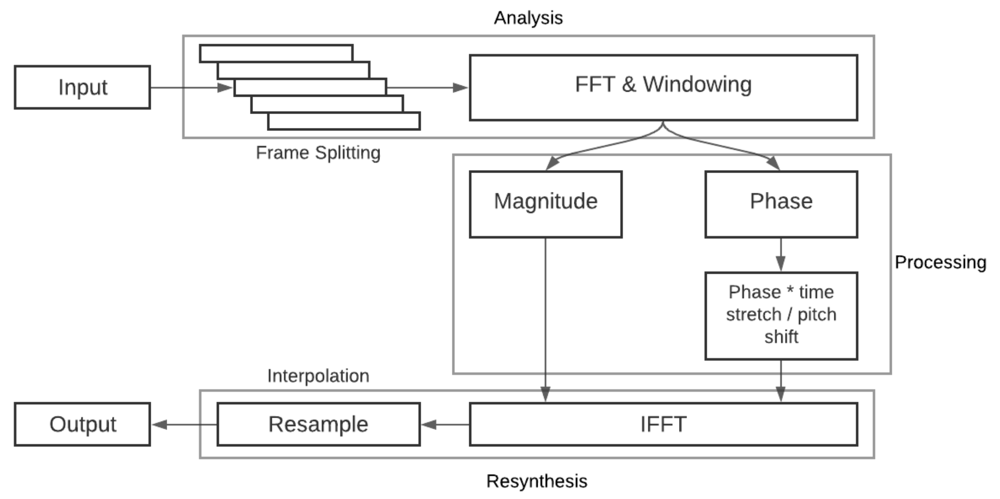
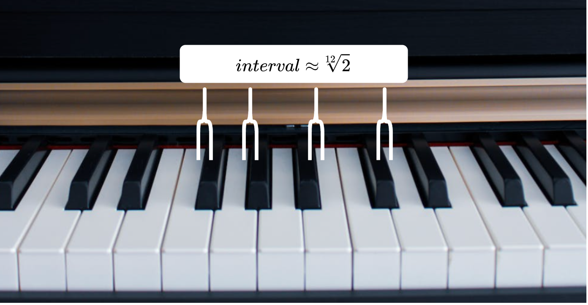

# phase-vocoder

This project is an implementation of the original phase vocoder by Flanagan & Golden (1966) in MATLAB. The phase vocoder is described as a technique in which signals are represented by their short-time phase and amplitude spectra. This provides a convenient way for compressing and stretching the signal’s time dimension. 

The algorithm consists of three main steps: analysis, processing, and resynthesis. This implementation of the phase vocoder mainly focuses on calculating instantaneous frequency for each frequency bin and incrementing it with the specified phase so it can be reconstructed.

Here's a block diagram to further illustrate the original phase vocoder algorithm:

<p align="center">
  
</p>

This implementation involves a little bit of music theory, thus is limited to the use of semitone values to determine the jump (or shift) in pitch. To be more specific, it is limited to using the 12-Tone Equal Temperament (12-TET) system, thus a the frequency distance between two notes is defined to be the 12th root of 2.

<p align="center">
  
</p>

*This was a final project developed in fulfillment of my Digital Signal Processing I course requirement in 2021.*

## Requirements

This project requires the **Signal Processing Toolbox** from MATLAB's add-ons for some of the functions to work properly.

## Run Locally

Clone the project

```bash
  git clone https://github.com/lorenzo-querol/phase-vocoder
```

Go to the project directory

```bash
  cd phase-vocoder
```

## Usage/Examples

```Matlab
% This shifts the C major scale to the G major scale
semiTones = 7;
audioFile = 'samples/c_major_scale.mp3';
ChangeKeySig(audioFile, semiTones);
```

Additionally, there is a live script named  `script.mlx` demonstrating the phase vocoder system included in the files.

## Acknowledgements
- François Grondin, for supplying some code implementation of the phase vocoder that was used to create this project.
